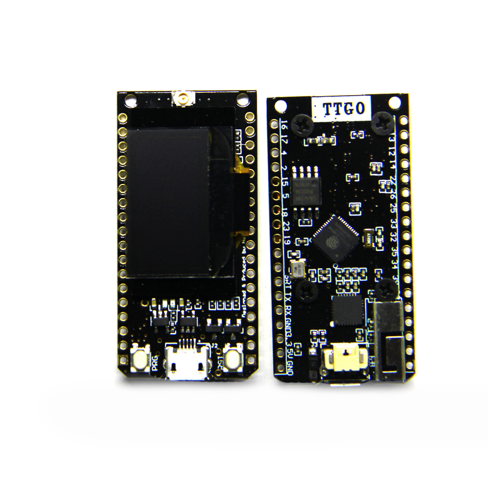

# Examples of two boards communicating using different software libraries
1. [master_tractor_simple](https://github.com/jones2126/ttgo_projects/tree/main/master_slave_hello_world/master_tractor_simple) - Hello World type program that would serve as the "master" (serial only output)
2. [slave_remote_control_simple](https://github.com/jones2126/ttgo_projects/tree/main/master_slave_hello_world/slave_remote%20control_simple) - Hello World type program that would serve as the "slave" (serial only output) 
3. [RF95_master_hello_world](https://github.com/jones2126/ttgo_projects/blob/main/master_slave_hello_world/RF95_master_hello_world/src/main.cpp) - Hello World type program that would serve as the "master" (serial only output); Uses the RadioHead RF95 library.
4. [RF95_slave_hello_world](https://github.com/jones2126/ttgo_projects/blob/main/master_slave_hello_world/RF95_slave_hello_world/src/main.cpp) - Hello World type program that would serve as the "slave" (serial only output); Uses the RadioHead RF95 library.
5.  [RadioLib_master_hello_world](https://github.com/jones2126/ttgo_projects/blob/main/master_slave_hello_world/RadioLib_master_hello_world/src/main.cpp) - Hello World type program that would serve as the "master" (serial only output); Uses the [Radio Lib library](https://github.com/jgromes/RadioLib/wiki).

Both of these programs use the LILYGO® TTGO LORA32 V1.0 board.  LoRa frequency is set to 915MHz.  Radio Head library is used for LoRa

Video showing 2 TTGO boards communicating using the RadioHead RF95 library: 

