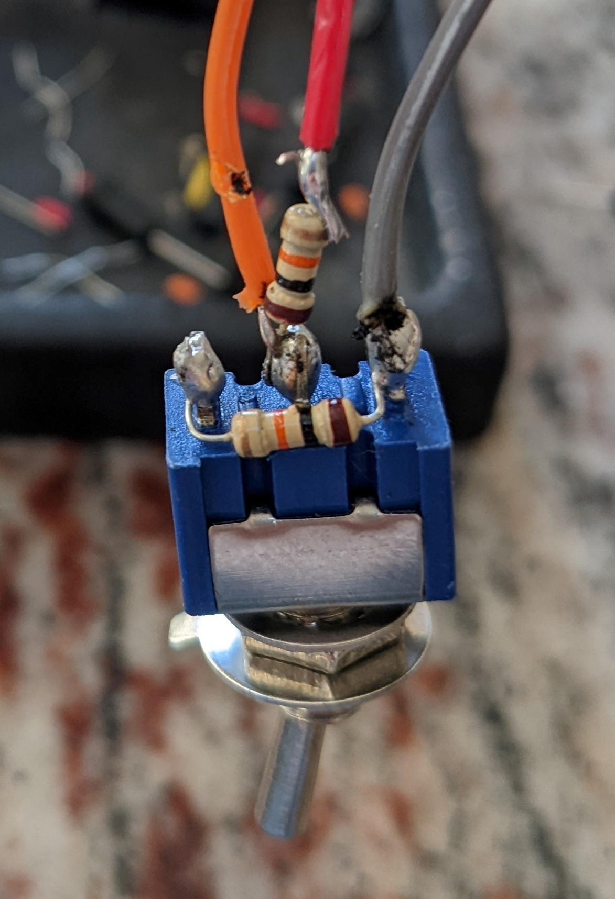

# ttgo_mode_switch_test
This program reads three inputs and prints out the results.  The inputs are associated with 
 2 potentiometers and a toggle switch.  The toggle switch has been fitted with 2 resistors in order
 to provide 3 modes/states (down, middle, up)

[Source code link](https://github.com/jones2126/ttgo_projects/blob/main/ttgo_mode_switch_test/src/main.cpp)